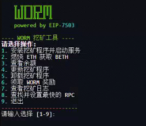

-----

# 🪱 WORM 挖矿工具

一个用户友好的命令行界面，用于在 Sepolia 测试网上安装、管理和操作 Worm Privacy 挖矿程序。



-----

## 官方链接

  - **GitHub:** [Worm Privacy 组织](https://github.com/worm-privacy)
  - **Discord:** [加入社区](https://discord.gg/4SYg84pQnw)
  - **X (Twitter):** [@WormPrivacy](https://x.com/WormPrivacy)

-----

## 快速开始

要使用 Worm 挖矿命令行工具，请下载脚本并在本地运行以启动交互式菜单。按照以下步骤操作：

* **下载脚本**：

```bash
curl -sSL https://raw.githubusercontent.com/Alocem/Worm-Lindwurm-Sepolia-testnet-miner-client/main/worm-lindwurm-testnet-miner-cli.sh -o worm-miner.sh
```

*  **使脚本可执行**：
```
chmod +x worm-miner.sh
```

*  **运行脚本**:
```
./worm-miner.sh
```

-----

## 菜单命令说明

1.  **安装挖矿程序并启动服务：** 安装所有依赖项，编译挖矿程序，保存您的私钥，并将挖矿程序作为后台服务启动（systemd）。

2.  **燃烧 ETH 获取 BETH：** 燃烧测试网 ETH 以获得燃烧 ETH（BETH），挖矿程序使用它来参与挖矿纪元。

3.  **查看余额：** 显示当前纪元、您钱包的当前 BETH 和 WORM 代币余额（在 Sepolia 测试网上）以及可领取的 WORM（最近10个纪元）。

4.  **更新挖矿程序：** 从官方仓库拉取最新代码，重新构建挖矿程序二进制文件，并重启后台服务。

5.  **卸载挖矿程序：** 停止服务并完全删除所有相关文件，包括挖矿程序、日志和您的私钥。

6.  **领取 WORM 奖励：** 检查并领取您从挖矿中获得的任何待领取 WORM 奖励。

7.  **查看挖矿日志：** 显示挖矿程序日志文件的最后15行，用于快速诊断和状态检查。

8.  **查找并设置最快的 RPC：** 对公共 RPC 列表运行延迟测试，找到并设置最快的 RPC 用于所有命令。

9.  **退出：** 关闭工具。

-----

## 高级配置

您可以通过编辑安装程序创建的文件来自定义挖矿程序的行为。

### 更改挖矿参数

要更改核心挖矿参数，您需要编辑挖矿程序的启动脚本。

1.  使用文本编辑器（如 `nano`）打开脚本：

    ```bash
    nano ~/miner/start-miner.sh
    ```

2.  修改以下标志的值：

      * `--amount-per-epoch`：指定您愿意在每个纪元花费多少 BETH。
      * `--num-epochs`：定义您希望提前参与多少个纪元。
      * `--claim-interval`：确定在领取操作之间等待多少个纪元。

3.  保存文件（`Ctrl+O`，然后 `Enter`）并退出（`Ctrl+X`）。

4.  重启挖矿服务以使更改生效：

    ```bash
    sudo systemctl restart worm-miner
    ```

### 手动设置 RPC 端点

脚本会在安装时自动找到最快的 RPC（或当您选择选项8时）。但是，您可以手动设置自定义的 Sepolia RPC。

1.  打开 RPC 配置文件：

    ```bash
    nano ~/.worm-miner/fastest_rpc.log
    ```

2.  将现有 URL 替换为您首选的 Sepolia RPC URL。

3.  保存文件并退出。挖矿程序将在下次启动或运行命令时使用这个新的 RPC。

-----

## 系统要求

**服务器：** 只有在燃烧阶段才需要16GB内存的机器。之后您可以使用典型的VPS服务器运行挖矿程序

**操作系统：** Ubuntu / Debian。

**磁盘空间：** 约10GB的可用磁盘空间，用于挖矿程序、依赖项和zk-SNARK参数。

-----

## 安全详情

**私钥：** 您的私钥本地存储在 `~/.worm-miner/private.key` 中，仅通过 `chmod 600` 权限保护。

**始终使用专门为此测试网创建的新钱包。**

### 不要重复使用主网密钥：永远不要使用持有真实资产的主网钱包的私钥。

-----

## Sepolia ETH 水龙头：

  * [Google Sepolia 水龙头](https://cloud.google.com/application/web3/faucet/ethereum/sepolia)
  * [Alchemy Sepolia 水龙头](https://www.alchemy.com/faucets/ethereum-sepolia)
  * [Sepolia PoW 水龙头](https://sepolia-faucet.pk910.de)
  * [Getblock Sepolia 水龙头](https://getblock.io/faucet/eth-sepolia/)